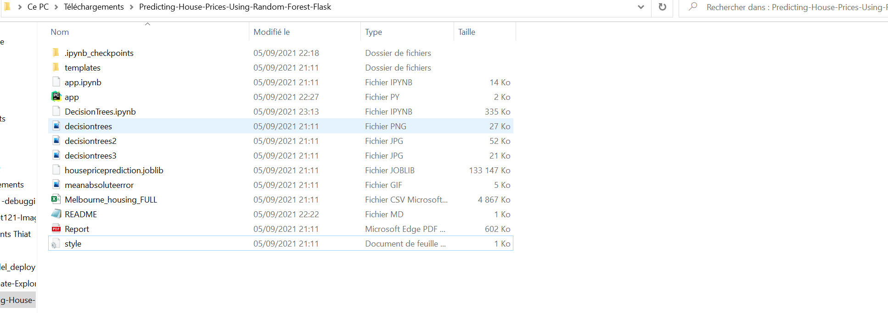
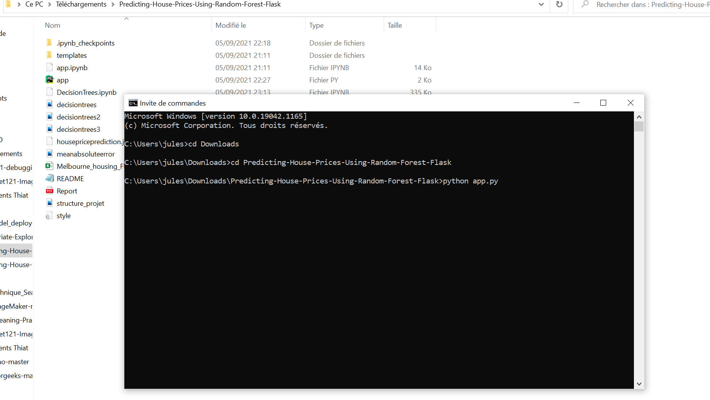
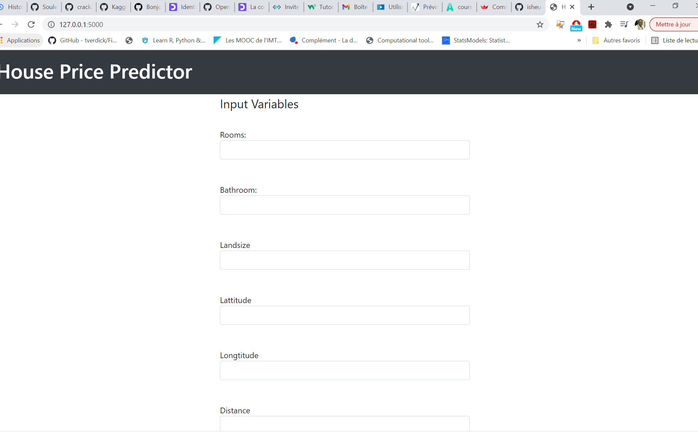

# Deploy_Predict_Price_House_Flask
## Predicting-Melbourne-House-Prices-Using-Random-Forest-Flask-Web-Application

<h2>Dependencies for running the web app</h2>

<li>
<ol>Joblib</ol>
<ol>Scikit-Learn</ol>
<ol>Flask</ol>
</li>

<h2>Project Folder Structure</h2>

To run the app navigate to the folder where the webapp is located and start command prompt and type "python app.py"

<h2>Web App Screenshots<h2>

  
 <h2>Link for house price prediction using decision trees and random forest jupyter notebook below </h2>
 <a href="https://github.com/SouleymaneSow/Deploy_Predict_Price_House_Flask/tree/Melbourne_Predict_House">Decision Tree and Random Forest Models Notebooks</a>

